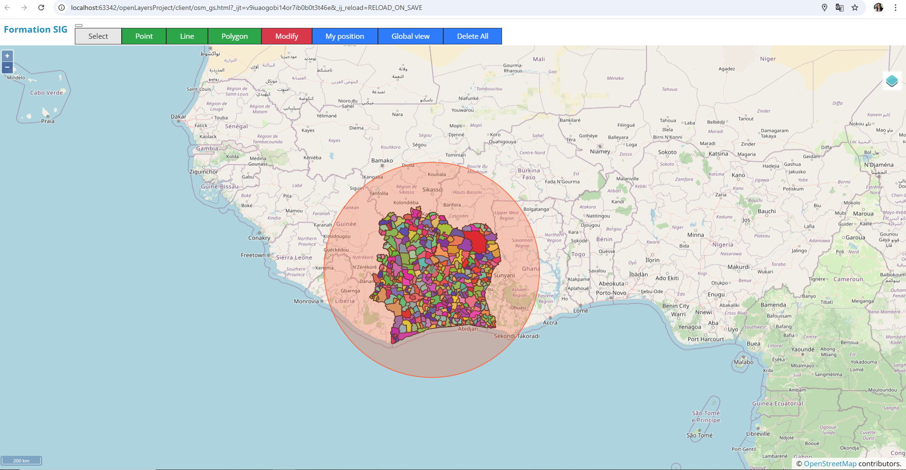
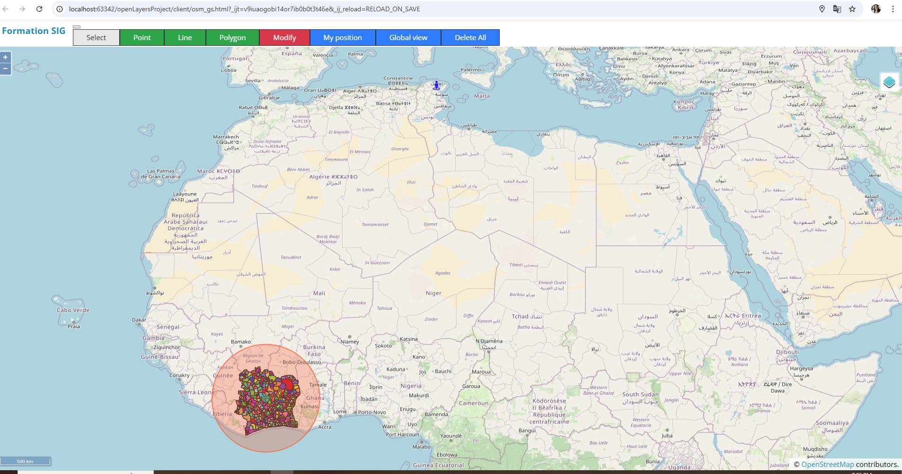
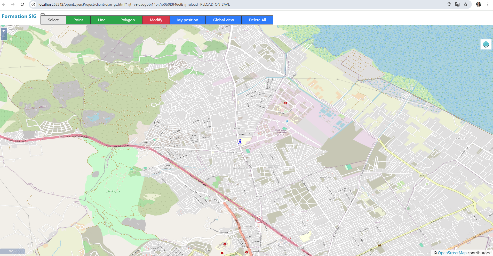

# OpenLayers Project 

Welcome to the OpenLayers Project! To get started, follow the steps below:

## Prerequisites 
Ensure that npm and Node.js are installed on your machine. 
Additionally, you need to have GeoServer running and set up to manage the layers.

## Setting up the Server
1. Go to the `server` directory.
2. Execute the following commands:
   ```bash
   npm install
   node service.js
## PostgresSQL Configuration 
Make sure that PostgreSQL is running on the port defined in the code.

The required tables in PostgreSQL will be created automatically, so you only need to set up the database and provide the necessary credentials in the code.

## GeoServer Setup
To configure GeoServer and manage the layers, follow these steps:
1.Install and Start GeoServer :
Download and install GeoServer from the official website. Once installed, start the GeoServer instance.

2.Add Layers to GeoServer :
In the GeoServer web interface, you can create and publish your layers. Make sure to connect GeoServer to your PostgreSQL database to allow it to serve the layers stored there.

3.Configure Layer Styles and WMS :
For each layer, configure the styles (SLD) and enable Web Map Service (WMS) or other protocols as required for your project.

4.Check Layer Availability :
After adding and configuring layers, you can verify that they are available by accessing GeoServer's WMS GetCapabilities URL.


## Screenshots

1. **OpenLayers Map with GeoServer Layers**
   

2. **Displaying the Global View of the Map**
   

3. **Displaying the local position**
   
